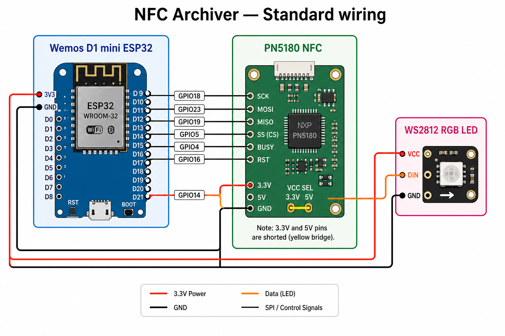
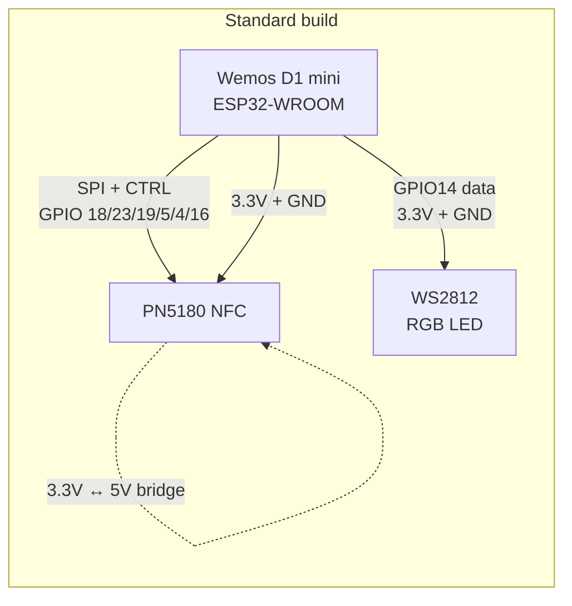
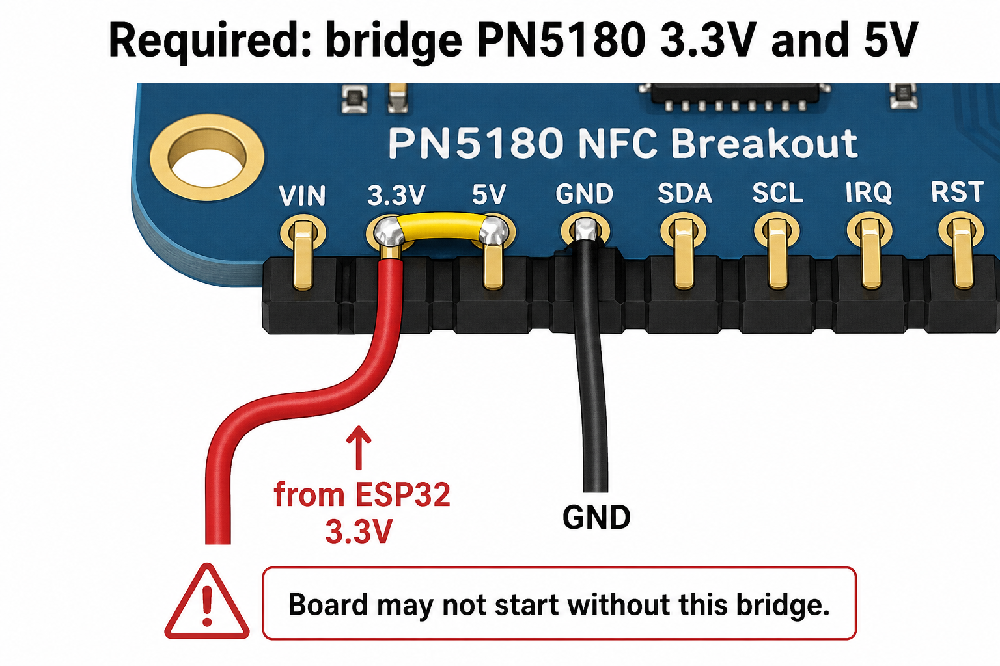
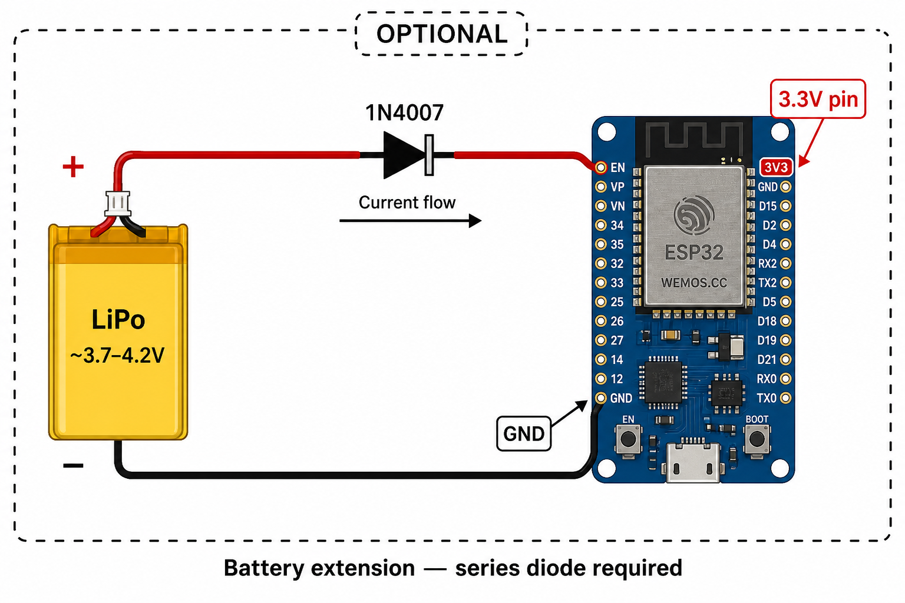
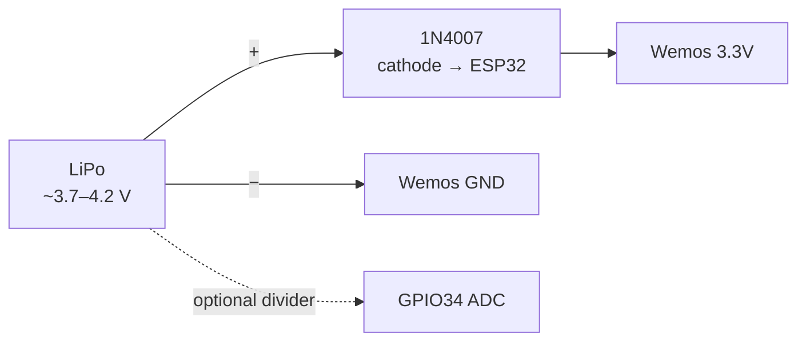

# Hardware — NFC Archiver

Reference hardware for the public NFC Archiver firmware image.

## Overview

| Item | Value |
|------|--------|
| Product | NFC Archiver |
| Manufacturer | RFIDfriend.com |
| MCU board | Wemos D1 mini ESP32-WROOM (`ESP32-WROOM`) |
| NFC frontend | NXP PN5180 |
| Status LED | WS2812 / WS2812B (1 pixel) |
| Power (standard) | USB on the Wemos (3.3 V rail shared with PN5180 + LED) |
| Power (optional) | LiPo battery extension — see [Optional: battery extension](#optional-battery-extension) |

The **standard build** is only three parts: **ESP32**, **PN5180**, and **RGB LED**. Battery hardware is an **optional extension**, not required to run the reader.

---

## Standard build

### Bill of materials (BOM)

| Qty | Part | Notes |
|-----|------|--------|
| 1 | Wemos D1 mini ESP32-WROOM | 3.3 V logic; USB for flash / power / serial |
| 1 | PN5180 NFC reader module | ISO 15693 / Vicinity; SPI |
| 1 | WS2812B LED (or strip segment) | Single pixel |
| — | Solder bridge / short jumper | Bridge PN5180 **3.3 V** ↔ **5 V** (required) |
| — | Wiring / headers | Match pinout below |
| — | Antenna | On-module or external per PN5180 design |

### Wiring overview



*Same diagram as SVG (sharp in browsers): [standard-wiring.svg](images/standard-wiring.svg)*



### Pinout (standard)

SPI and control between **ESP32** and **PN5180**, plus LED data:

| Signal | ESP32 GPIO | PN5180 / LED |
|--------|------------|----------------|
| SPI SCK | **18** | SCK |
| SPI MOSI | **23** | MOSI |
| SPI MISO | **19** | MISO |
| Chip select | **5** | NSS / CS |
| Busy | **4** | BUSY |
| Reset | **16** | RST |
| LED data | **14** | WS2812 DIN (board label often **TMS**) |
| 3.3 V | **3.3V** | PN5180 **3.3V** + **5V** (bridged), LED VCC |
| Ground | **GND** | PN5180 GND, LED GND |

#### Quick reference

```
SCK  18
MOSI 23
MISO 19
CS    5
BUSY  4
RST  16
LED  14
```

### Required: PN5180 `3.3V` ↔ `5V` bridge

On most PN5180 modules the **3.3 V** and **5 V** supply pins sit next to each other. For the standard USB/ESP32‑only build, feed the module from the Wemos **3.3 V** rail and **short those two pins** (solder bridge or jumper) so **3.3 V is applied to both**.



*[SVG](images/pn5180-bridge.svg)*

| Without bridge | With bridge |
|----------------|-------------|
| Often only one supply domain is powered → module does not boot / RF never comes up | Both module supply pins see 3.3 V → board starts |

```
Wemos 3.3V  ──►  PN5180 3.3V  ──(short)──  PN5180 5V
Wemos GND   ──►  PN5180 GND
```

SPI and control stay at **3.3 V logic**. Do **not** drive ESP32 GPIOs with 5 V.

> Dedicated 5 V on the module’s `5V` pin can improve RF range when a true 5 V rail exists. For the standard ESP32‑only build, bridging both pins to **3.3 V** is the documented working setup.

### Standard power

Power the Wemos over **USB**. The onboard regulator supplies the shared **3.3 V** rail for ESP32, bridged PN5180, and LED.

---

## Optional: battery extension

Battery operation is **not** part of the standard reader. Add it only if you want portable / off‑USB use. Firmware can report battery level via ADC when you wire a sense path to **GPIO34**.

### Extra parts

| Qty | Part | Notes |
|-----|------|--------|
| 1 | LiPo / battery pack | Typical single‑cell ~3.7 V nominal |
| 1 | Silicon diode **1N4007** (or ~0.6–0.7 V drop equivalent) | Series drop into Wemos **3.3V** |
| — | Voltage divider (or board‑specific sense) | Battery sense → **GPIO34** |

### Wiring (optional)



*[SVG](images/battery-option.svg)*



A full LiPo can sit around **4.0–4.2 V** (e.g. 4.09 V). That is **above the ~3.6 V limit** of the PN5180 digital/interface supply. Feeding the pack straight into the Wemos **3.3 V** pin often leaves the ESP32 running while the PN5180 fails to start.

Place the **1N4007** in series: battery **+** → diode → Wemos **3.3 V**. Forward drop (~0.6–0.7 V) brings a full pack down to about **3.3–3.5 V** on the shared rail (ESP32 + bridged PN5180).

| Diode pin | Connect to |
|-----------|------------|
| Anode (no stripe) | Battery **+** |
| Cathode (stripe) | Wemos **3.3 V** |

```
Battery (+) ──►|── (1N4007) ──► Wemos 3.3V
Battery (−) ──────────────────► Wemos GND
```

Optional: battery voltage divider → **GPIO34** (ADC1, input‑only). Exact resistor values depend on your pack; firmware expects a usable ADC reading on GPIO34.

**USB + battery:** Prefer a proper charge/protection board so USB 5 V and the pack do not fight. When running from USB alone, the Wemos regulator supplies 3.3 V.

**Alternative:** Feed the pack into **5 V / VIN** via a LiPo charge module so the onboard LDO regulates 3.3 V. The series **1N4007** into the **3.3 V** pin is the documented fix for *direct* battery‑to‑rail wiring.

---

## Notes

- Logic levels are **3.3 V**. Do not drive the ESP32 or PN5180 with 5 V IO.
- Keep SPI wires short; poor wiring shows up as flaky NFC or bus hangs.
- USB on the Wemos is used for the [Web Serial flasher](../flash/) and serial logs (typically 115200 baud).
- ESP32 boots but NFC dead → check the **3.3 V↔5 V bridge**. Battery pack and PN5180 flaky → check the optional **1N4007** drop.

## Related

- [features.md](features.md) — software features that use this hardware
- [flashing.md](flashing.md) — how to load firmware
- [ble-protocol.md](ble-protocol.md) — wireless API once flashed
