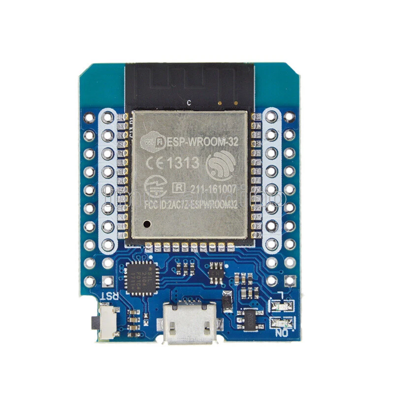
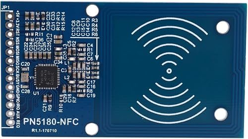
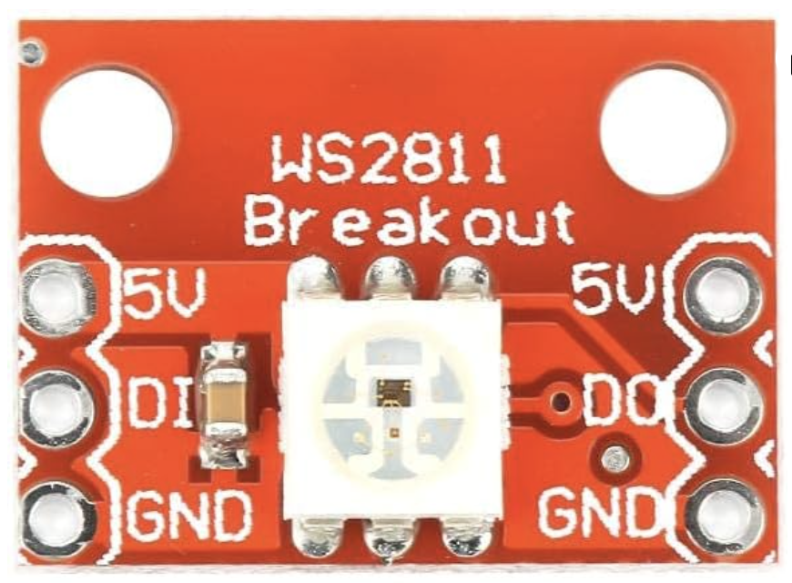
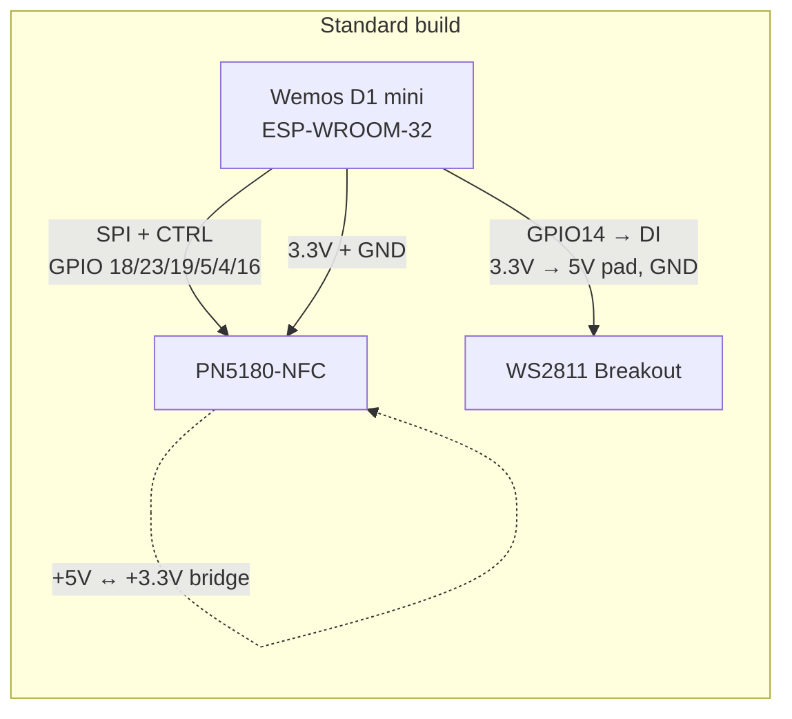
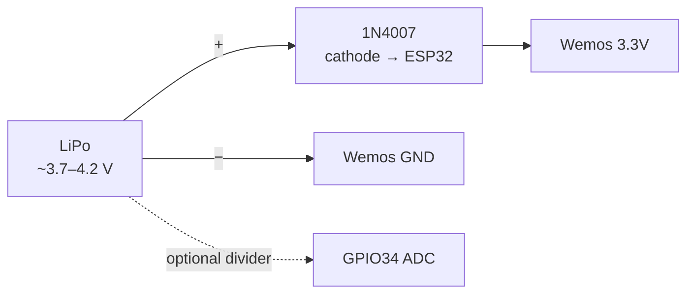

# Hardware — NFC Archiver

Reference hardware for the public NFC Archiver firmware image.

## Overview

| Item | Value |
|------|--------|
| Product | NFC Archiver |
| Manufacturer | RFIDfriend.com |
| MCU board | Wemos D1 mini ESP32-WROOM (`ESP-WROOM-32`) |
| NFC frontend | PN5180-NFC module (e.g. rev **R1.1-170710**) |
| Status LED | **WS2811 Breakout** (NeoPixel-compatible single LED) |
| Power (standard) | USB on the Wemos (shared **3.3 V** rail) |
| Power (optional) | LiPo battery extension — see [Optional: battery extension](#optional-battery-extension) |

The **standard build** is only three parts: **ESP32**, **PN5180-NFC**, and **WS2811 Breakout**. Battery hardware is an **optional extension**, not required to run the reader.

### Components (reference photos)

| Wemos D1 mini ESP32 | PN5180-NFC | WS2811 Breakout |
|:-------------------:|:----------:|:---------------:|
|  |  |  |

---

## Standard build

### Bill of materials (BOM)

| Qty | Part | Notes |
|-----|------|--------|
| 1 | Wemos D1 mini ESP32-WROOM | `ESP-WROOM-32`; USB for flash / power / serial |
| 1 | PN5180-NFC reader module | Header **JP1**: `+5V`, `+3.3V`, `RST`, `NSS`, `MOSI`, `MISO`, `SCK`, `BUSY`, `GND`, … |
| 1 | WS2811 Breakout | Pads **5V / DI / GND** (single status LED) |
| — | Solder bridge / short jumper | Bridge PN5180 **`+5V` ↔ `+3.3V`** (required) |
| — | Wiring / headers | Match pinout below |

### Wiring overview




### Pinout (standard)

| Signal | ESP32 GPIO / rail | Destination |
|--------|-------------------|-------------|
| SPI SCK | **GPIO18** | PN5180 **SCK** |
| SPI MOSI | **GPIO23** | PN5180 **MOSI** |
| SPI MISO | **GPIO19** | PN5180 **MISO** |
| Chip select | **GPIO5** | PN5180 **NSS** |
| Busy | **GPIO4** | PN5180 **BUSY** |
| Reset | **GPIO16** | PN5180 **RST** |
| LED data | **GPIO14** | WS2811 **DI** (board label on ESP32 often **TMS**) |
| 3.3 V | **3.3V** | PN5180 **`+3.3V` + `+5V`** (bridged); WS2811 **5V** pad |
| Ground | **GND** | PN5180 **GND**; WS2811 **GND** |

PN5180 pins **GPIO / IRQ / AUX / REQ** are unused in the standard firmware build.

#### Quick reference

```
SCK   GPIO18  →  PN5180 SCK
MOSI  GPIO23  →  PN5180 MOSI
MISO  GPIO19  →  PN5180 MISO
CS    GPIO5   →  PN5180 NSS
BUSY  GPIO4   →  PN5180 BUSY
RST   GPIO16  →  PN5180 RST
LED   GPIO14  →  WS2811 DI
3.3V          →  PN5180 +3.3V/+5V (bridged), WS2811 5V
GND           →  PN5180 GND, WS2811 GND
```

> **LED power:** One WS2811 status LED can run from the ESP32 **3.3 V** rail into the breakout’s **5V** pad. Do **not** power long LED strips from 3.3 V.

### Required: PN5180 `+5V` ↔ `+3.3V` bridge

On the PN5180-NFC module (JP1), **`+5V`** and **`+3.3V`** are the **top two adjacent pins**. For the standard USB/ESP32‑only build, feed the module from the Wemos **3.3 V** rail and **short those two pins** (solder bridge or jumper) so **3.3 V reaches both**.


| Without bridge | With bridge |
|----------------|-------------|
| Often only one supply domain is powered → module does not boot / RF never comes up | Both supply pins see 3.3 V → board starts |

```
Wemos 3.3V  ──►  PN5180 +3.3V  ──(short)──  PN5180 +5V
Wemos GND   ──►  PN5180 GND
```

SPI and control stay at **3.3 V logic**. Do **not** drive ESP32 GPIOs with 5 V.

> Confirm silkscreen on your module revision before soldering. Dedicated 5 V on `+5V` can improve RF range when a true 5 V rail exists; for the standard ESP32‑only build, bridging to **3.3 V** is the documented setup.

### Standard power

Power the Wemos over **USB**. The onboard regulator supplies the shared **3.3 V** rail for ESP32, bridged PN5180, and the status LED.

---

## Optional: battery extension

Battery operation is **not** part of the standard reader. Add it only if you want portable / off‑USB use. Firmware can report battery level via ADC when you wire a sense path to **GPIO34**.

### Extra parts

| Qty | Part | Notes |
|-----|------|--------|
| 1 | LiPo / battery pack | Typical single‑cell ~3.7 V nominal |
| 1 | Silicon diode **1N4007** (or ~0.6–0.7 V drop equivalent) | Series drop into Wemos **3.3V** |
| — | Voltage divider (or board‑specific sense) | Battery sense → **GPIO34** |

### Wiring (optional)




A full LiPo can sit around **4.0–4.2 V** (e.g. 4.09 V). That is **above the ~3.6 V limit** of the PN5180 digital/interface supply. Feeding the pack straight into the Wemos **3.3 V** pin often leaves the ESP32 running while the PN5180 fails to start.

Place the **1N4007** in series: battery **+** → diode → Wemos **3.3 V**. Forward drop (~0.6–0.7 V) brings a full pack down to about **3.3–3.5 V** on the shared rail (ESP32 + bridged PN5180).

| Diode pin | Connect to |
|-----------|------------|
| Anode (no stripe) | Battery **+** |
| Cathode (stripe) | Wemos **3.3 V** |

```
Battery (+) ──►|── (1N4007) ──► Wemos 3.3V
Battery (−) ──────────────────► Wemos GND
```

Optional: battery voltage divider → **GPIO34** (ADC1, input‑only). Exact resistor values depend on your pack; firmware expects a usable ADC reading on GPIO34.

**USB + battery:** Prefer a proper charge/protection board so USB 5 V and the pack do not fight. When running from USB alone, the Wemos regulator supplies 3.3 V.

**Alternative:** Feed the pack into **5 V / VIN** via a LiPo charge module so the onboard LDO regulates 3.3 V. The series **1N4007** into the **3.3 V** pin is the documented fix for *direct* battery‑to‑rail wiring.

---

## Notes

- Logic levels are **3.3 V**. Do not drive the ESP32 or PN5180 with 5 V IO.
- Keep SPI wires short; poor wiring shows up as flaky NFC or bus hangs.
- USB on the Wemos is used for the [Web Serial flasher](../flash/) and serial logs (typically 115200 baud).
- ESP32 boots but NFC dead → check the **`+5V` ↔ `+3.3V` bridge**. Battery pack and PN5180 flaky → check the optional **1N4007** drop.

## Related

- [features.md](features.md) — software features that use this hardware
- [flashing.md](flashing.md) — how to load firmware
- [ble-protocol.md](ble-protocol.md) — wireless API once flashed
